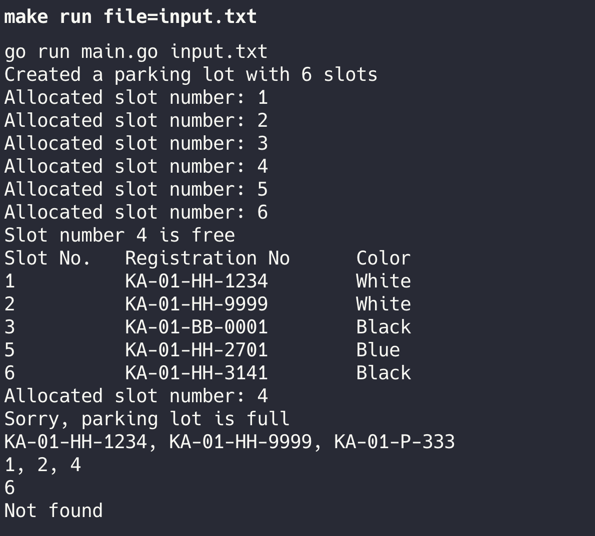
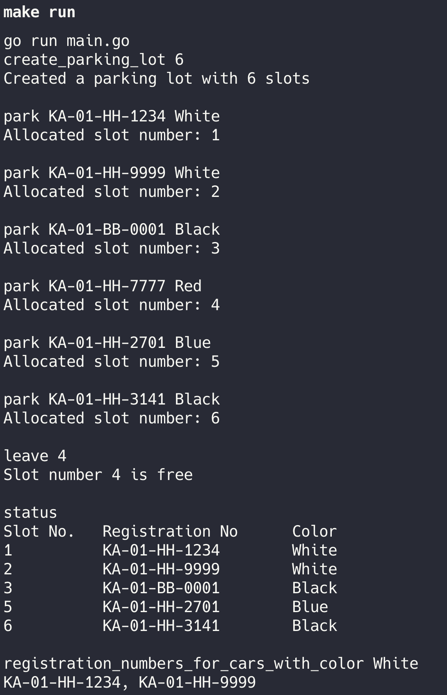

# Parking Lot System

This a CLI based Go application that simulates a car parking system. The system allows to create a parking lot of a definite size (max slot size of 20K), park the cars, leave the slot, get status of parked cars and various other queries outlined below.

It system operates in 2 modes:

> 1.  File Mode: In this mode the application is invoked by providing a .txt file, which has pre-defined commands that the application understand and processes. The file is read line-by-line (stream mode) and each command is processed sequentially. All the responses created by executing all the commands in the file are displayed sequentially.

> 2.  Interactive Mode - In this mode, the terminal allows an input which is a command and upon pressing enter the command gets executed and displays the response.

### Parking Lot - Commands (examples)

1. **create_parking_lot 6** - Creates a parking lot of size 6
2. **park KA-01-HH-1234 White** - Parks a new car with registration number and color specified.
3. **leave 4** - Car vacates the slot 4.
4. **status** - This prints the slot number, parked car's registration number and color.
5. **registration_numbers_for_cars_with_color White** - This queries the system to display registration numbers of all parked cars with color **White**.
6. **slot_numbers_for_cars_with_color White** - This displays slot numbers of all parked cars with color **White**
7. **slot_number_for_registration_number KA-01-HH-3141** - This displays slot number of the parked car with registration number **KA-01-HH-3141**.
8. **exit** - Closes the app.

## Run the app

#### To run the application, we have provided a makefile, hence make commands can be used.

> To run the app in **File mode**, please run below command in the root of the project directory. You have to provide the file name containing your commands by replacing **<input_file_name>** in below command.

```bash
make run file=<input_file_name>
```

Below is sample of a file based command session


> To run the app in **Interactive mode**, please run below command in the root of the project directory.

```bash
make run
```

Then you can keep on entering one command at one time and after pressing ENTER, a response will be shown. In this mode you can exit the application by entering **exit** command

> > **NOTE**: Whether File/Interactive mode, the first command should always be **create_parking_lot** command. Because logically without a parking lot of a definite size, no other command can work.

Below is sample of an interactive command session:



## Run the unit tests

#### To run the test, execute below make command from project root:

```bash
make test
```

> NOTE: The tests are only provided to for : runFileBasedMode() and runInteractiveMode() functions, which covers all the code base and flow of the application.

## _Notes_

1. The slot has a maximum capacity of 20000. If more than this capacity specified, an error will be displayed.
2. Any unidentified command will be marked, and an error message will be dispalyed as "invalid command"
3. If a command requires arguments and not provided, then an error will be shown on terminal for the same.
4. A sample **input.txt** file is attached with the project to help in testing the app.
